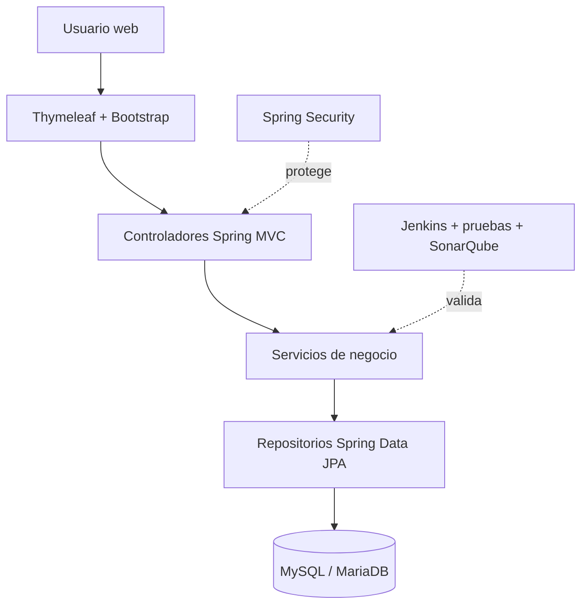

# Arquitectura

## Vista general

EspigaCloud utiliza una arquitectura en capas de tipo monolítico modular:

## Capas

| Capa | Responsabilidad | Ubicación |
|---|---|---|
| Presentación | Formularios, listas y navegación | `src/main/resources/templates` |
| Controladores | Rutas HTTP y validación de entrada | `controller` |
| Formularios | DTO y restricciones Jakarta Validation | `form` |
| Servicios | Reglas de negocio | `service` |
| Persistencia | Consultas y acceso a datos | `repository` |
| Dominio | Entidades JPA | `entity` |
| Seguridad | Autenticación y autorización | `config/SecurityConfig.java` |

## Entidades principales

- `Usuario`: cuenta, contraseña cifrada, rol y estado.
- `Producto`: nombre, categoría, precio y stock.
- `Tienda`: nombre, dirección, teléfono y estado.
- `Pedido`: fecha, estado y tienda.
- `DetallePedido`: producto, pedido y cantidad.
- `PedidoEspecial`: cliente, especificaciones, entrega, tienda e imagen.

## Validación y seguridad

Las entradas se validan en dos niveles:

1. restricciones HTML (`required`, `min`, `step`, patrones y longitudes);
2. Jakarta Validation en el servidor (`@NotBlank`, `@Positive`, `@Pattern`, `@FutureOrPresent`, entre otras).

Spring Security controla las rutas por rol y protege formularios con CSRF. Las contraseñas se almacenan cifradas y los secretos de configuración se suministran mediante variables de entorno.
