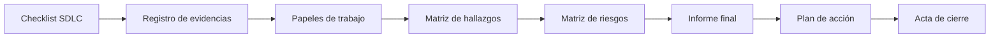

# Auditoría SDLC

## Resumen ejecutivo

La auditoría académica del ciclo de vida evaluó gestión, requisitos, arquitectura, desarrollo, pruebas, seguridad, implementación, mantenimiento y documentación. Se usaron como referencia ISO/IEC 12207, ISO/IEC 25010, CMMI-DEV, Scrum y OWASP Top 10.

  
<strong>57%</strong>cumplimiento global

  
<strong>56</strong>ítems evaluados

  
<strong>38</strong>evidencias registradas

  
<strong>2</strong>riesgos altos

## Fases

| Fase | Actividades | Entregables principales |
|---|---|---|
| I. Preparación | Alcance, criterios, planificación | Charter, plan, checklist y comunicación |
| II. Ejecución | Entrevistas y recolección de evidencia | Registro de entrevistas, evidencias y papeles de trabajo |
| III. Análisis | Hallazgos, riesgos y dictamen | Matrices e informes preliminar/final |
| IV. Seguimiento | Acciones y cierre | Plan correctivo, acta y archivo |

## Fortalezas

- automatización de pruebas y CI/CD;
- control de versiones y evidencia reproducible;
- arquitectura en capas;
- autenticación y autorización por roles;
- pruebas unitarias, integración, E2E y rendimiento.

## Brechas prioritarias

El expediente identifica diez hallazgos. Los dos riesgos de nivel alto son:

1. ausencia de un Plan Maestro de Pruebas consolidado;
2. gestión inadecuada de credenciales de configuración inicial.

El repositorio actual ya incorpora mejoras relacionadas: variables de entorno para secretos, validaciones de entrada, pipeline Jenkins, reportes automatizados y esta documentación centralizada en MkDocs.

## Trazabilidad

Consulte y descargue cada documento desde [Evidencias y descargas](evidencias.md).
