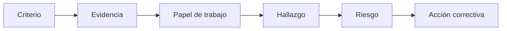

# Metodología

## Enfoque

La auditoría se ejecutó como autoevaluación formal basada en evidencia. Las integrantes de DulceCode actuaron en roles diferenciados de desarrollo y auditoría, aplicando revisión cruzada.

## Fases

| Fase | Actividad | Resultado |
|---|---|---|
| I. Preparar | Definir alcance, criterios, cronograma y responsables | Charter, plan, checklist y comunicación |
| II. Ejecutar | Entrevistar, inspeccionar código y recopilar evidencia | Registros y papeles de trabajo |
| III. Analizar | Clasificar hallazgos y valorar riesgos | Matrices e informes |
| IV. Cerrar | Definir acciones, responsables y seguimiento | Plan correctivo y acta de cierre |

## Técnicas aplicadas

1. revisión documental;
2. entrevistas cruzadas;
3. inspección del repositorio y configuración;
4. ejecución de pruebas automatizadas;
5. análisis JaCoCo y SonarQube;
6. revisión de Jenkins, Docker y evidencias k6/Playwright;
7. trazabilidad entre criterio, evidencia, hallazgo, riesgo y acción.

## Escala de resultado

- **Cumple:** evidencia suficiente y control operativo.
- **Cumple parcialmente:** existe implementación, pero falta formalización o cobertura.
- **No cumple:** no existe control o evidencia suficiente.
