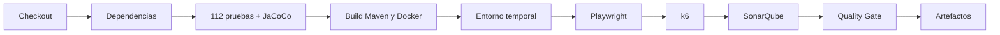

# Jenkins y CI/CD

## Acceso local

| Servicio | Dirección |
|---|---|
| Aplicación Spring | `http://localhost:8080` |
| Jenkins | `http://localhost:8090` |
| SonarQube | `http://localhost:9000` |
| Aplicación temporal del pipeline | `http://localhost:8085` |

## Flujo del pipeline



## Etapas

1. descarga el repositorio;
2. prepara dependencias Maven;
3. ejecuta pruebas y cobertura mínima del 80%;
4. empaqueta la aplicación y construye su imagen;
5. levanta MySQL y la aplicación en un proyecto Docker aislado;
6. ejecuta Playwright y archiva JUnit/HTML;
7. ejecuta smoke tests k6 y archiva resúmenes JSON;
8. analiza con SonarQube y espera el Quality Gate;
9. conserva JAR, reportes y documentos.

## Levantar Jenkins y SonarQube

```powershell
cd devops
Copy-Item .env.example .env
# Configure JENKINS_ADMIN_PASSWORD dentro de .env
docker compose up -d --build
```

El contenedor Jenkins requiere acceso autorizado al socket Docker para construir imágenes y levantar ambientes temporales.

## Publicación de esta documentación

El workflow `.github/workflows/docs.yml` valida el sitio con `mkdocs build --strict` y publica la rama `gh-pages` automáticamente después de cada cambio documental en `main`.

Consulte el [manual detallado de configuración](MANUAL_CONFIGURACION_CICD.md).
